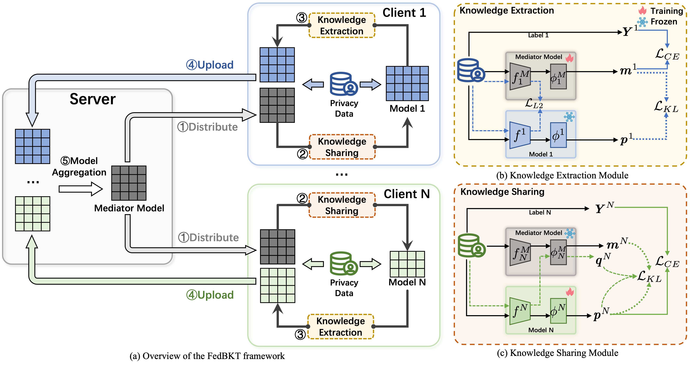

# FedBKT: Federated Learning with Model Heterogeneity via Bidirectional Knowledge Transfer with Mediator Model

This repository contains the implementation of FedBKT, a novel federated learning framework that enables efficient knowledge transfer between heterogeneous models while preserving model personalization.

## Paper Information

**Title**: FedBKT: Federated Learning with Model Heterogeneity via Bidirectional Knowledge Transfer with Mediator Model


**Conference**: ICIC 2025 (International Conference on Intelligent Computing)

## Framework Overview

<div align="center">

</div>

The framework consists of three main components:
1. **Mediator Model**: A central model that facilitates knowledge exchange between clients
2. **Knowledge Sharing Module**: Transfers global knowledge from the mediator to local models
3. **Knowledge Extraction Module**: Extracts local knowledge to update the global model


## Requirements

```bash
pip install -r requirements.txt
```

## Usage

### Basic Usage

```python
from config.config import Config
from train import FedBKT

# Initialize configuration
config = Config()

# Create and train the model
fedbkt = FedBKT(config)
fedbkt.train()
```

### Custom Configuration

You can customize the training process by modifying the configuration:

```python
from config.config import Config

config = Config()
config.num_clients = 10
config.num_rounds = 100
config.local_epochs = 5
config.batch_size = 32
config.learning_rate = 0.01

fedbkt = FedBKT(config)
fedbkt.train()
```

## Citation

If you find this work useful for your research, please cite our paper:

```bibtex
@inproceedings{fedbkt2025,
  title={FedBKT: Federated Learning with Model Heterogeneity via Bidirectional Knowledge Transfer with Mediator Model},
  author={Min, Qi and Wang, Hui and Jia, Peng and Qiu, Yuan and Gu, Chunhua and Ding, Weichao},
  booktitle={International Conference on Intelligent Computing (ICIC)},
  year={2025}
}
```

## License

This project is licensed under the MIT License - see the LICENSE file for details.

## Acknowledgments

We thank ...
